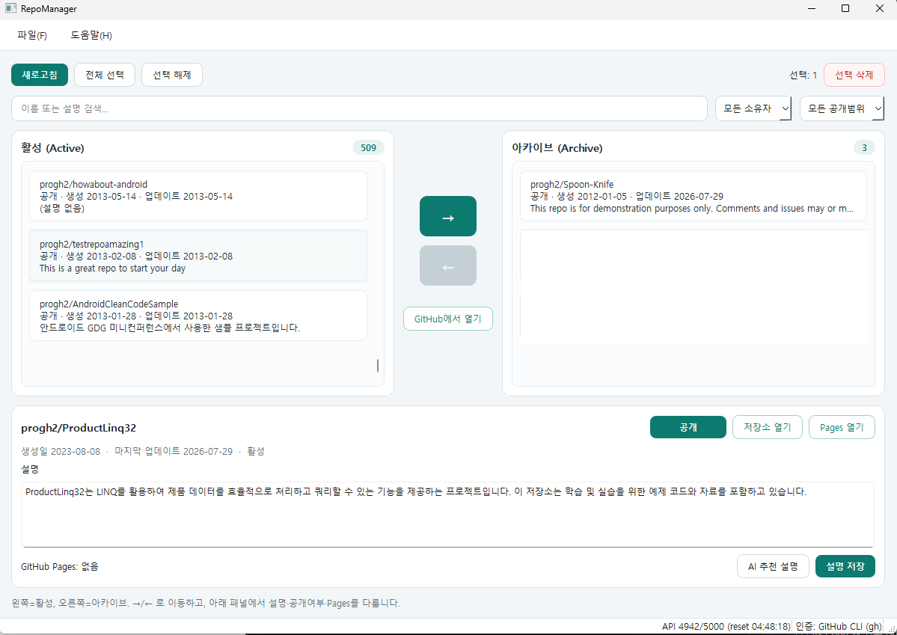

# RepoManager

수업·실습 후 남는 GitHub 저장소를 GUI에서 골라 **아카이브**하거나 **삭제**하는 데스크톱 앱입니다.  
Windows, macOS, Linux에서 동작합니다 (PySide6).



## 기능

- 전체 UI 다국어 지원 (한국어 / English / 日本語, 시스템 기본)
- 설정 메뉴에서 PAT / GitHub CLI / 웹 로그인(Device Flow)
- 토큰은 OS 자격 증명 저장소(keyring)에 안전하게 저장
- 활성 / 아카이브 이중 목록과 → ← 이동
- 생성일·업데이트일, 설명 편집, **이름 변경**(RENAME 확인), 공개/비공개 토글, GitHub Pages 링크
- **ZIP 백업**: 모든 브랜치(git mirror) + 이슈·마일스톤 JSON (삭제 전 백업용)
- AI 추천 설명 (GitHub Models / Copilot 권한 필요, UI 언어로 생성)
- 인증된 계정의 저장소 목록 불러오기 (owner / organization / collaborator)
- **Public / Private**, 설명(description), 이름·소유자, 업데이트 시각 표시
- 검색·**Owner**·가시성 필터, 정렬(이름 / 업데이트순 / 생성순), 다중 선택
- 행 더블클릭 시 브라우저에서 GitHub 페이지 열기
- 선택 저장소 **일괄 Archive / Delete**
- 실행 전 확인 창(이름 + 설명 + 경고, 삭제는 `DELETE` 입력)
- API rate limit 표시, rate limit 시 제한적 재시도
- API 호출은 백그라운드 스레드로 처리 (UI 멈춤 방지)

## 요구 사항

- Python 3.11+
- GitHub Personal Access Token

## 빠른 실행 (권장)

저장소를 받은 뒤 실행 스크립트 하나로 시작할 수 있습니다.  
첫 실행 시 자동으로 가상환경(`.venv`)을 만들고 의존성을 설치합니다.

```bash
# Windows — 더블클릭 또는 터미널에서
run.bat

# macOS / Linux
./run.sh
```

- 의존성만 다시 설치하려면: `run.bat --update` / `./run.sh --update`
- Python 3.11 이상이 설치되어 있어야 합니다.

## 수동 설치

```bash
python -m venv .venv

# Windows
.venv\Scripts\activate

# macOS / Linux
source .venv/bin/activate

pip install -r requirements.txt
# 또는 개발 설치
pip install -e ".[dev]"

copy .env.example .env   # Windows
# cp .env.example .env   # macOS / Linux
```

`.env`에 토큰을 넣습니다.

```env
GITHUB_TOKEN=ghp_your_token_here
```

## 실행

```bash
python -m repomanager
```

## GitHub 인증

다음 중 하나로 인증합니다 (우선순위: 환경변수 → Settings 저장 토큰 → `gh`).

### 1) 설정 메뉴 (권장)

앱 실행 후 **File → Settings** (`Ctrl+,`) 또는 **Account → GitHub credentials**.

- **Personal Access Token** 붙여넣기 후 Save
- 또는 **Import from GitHub CLI** (`gh auth login` 되어 있을 때)
- 또는 **Sign in with GitHub (browser)** — OAuth Device Flow (아래)

토큰은 OS 자격 증명 저장소(Windows Credential Manager / macOS Keychain / Linux Secret Service)에
`keyring`으로 안전하게 저장됩니다. keyring을 쓸 수 없는 환경에서만 Qt `QSettings`로 대체됩니다.

### 2) `.env` / 환경변수

```env
GITHUB_TOKEN=ghp_your_token_here
GITHUB_OAUTH_CLIENT_ID=Iv1...   # 웹 로그인용(선택)
```

### 3) 웹 로그인 (OAuth Device Flow)

브라우저 로그인은 가능하지만, **GitHub OAuth App의 Client ID**가 필요합니다.  
(일반 웹사이트처럼 “아무 앱이나” 바로 로그인하는 방식은 GitHub가 허용하지 않습니다.)

1. https://github.com/settings/developers → **New OAuth App**
2. Application name: `RepoManager` (자유)
3. Homepage URL: `https://github.com/progh2/repomanager`
4. Authorization callback URL: `http://127.0.0.1`
5. 생성 후 **Device Flow** 활성화, **Client ID**만 Settings에 입력  
   (**Client Secret은 데스크톱 앱에 넣지 마세요**)
6. Settings에서 **Sign in with GitHub** → 브라우저에 표시된 코드 입력

요청 스코프: `repo`, `delete_repo`, `read:org`

### GitHub CLI로 삭제 권한 추가

`gh` 기본 로그인에는 `delete_repo`가 없는 경우가 많습니다. 삭제가 403이면:

```bash
gh auth refresh -h github.com -s delete_repo
```

그다음 앱 Settings에서 **Import from GitHub CLI** 또는 Prefer gh CLI를 켠 뒤 다시 시도하세요.

## 사용 방법

1. 앱 실행 → 토큰이 없으면 설정 안내
2. **파일 → 설정**에서 인증 구성 후 저장
3. **새로고침**으로 저장소 목록 로드
4. **왼쪽(활성)** / **오른쪽(아카이브)** 목록에서 대상 선택
5. 가운데 **→** 로 아카이브, **←** 로 활성 복원
6. **GitHub에서 열기**(또는 더블클릭)로 페이지 확인
7. 삭제는 선택 후 **선택 삭제** (DELETE 입력, `delete_repo` 권한 필요)

삭제가 403이면 **도움말 → 삭제 권한 안내** 또는 설정 상단 안내를 따르세요.

## 주의

- **삭제는 되돌릴 수 없습니다.** 삭제 확인 창에서 CSV 내보내기 또는 **ZIP 백업**을 먼저 하세요.
- ZIP 백업에는 `git clone --mirror`로 만든 전체 브랜치/태그 미러와 이슈·마일스톤 JSON이 포함됩니다. (로컬에 Git이 필요합니다)
- 아카이브는 읽기 전용으로 남기며, 나중에 GitHub에서 unarchive할 수 있습니다.

## 배포판 / 패키징

GitHub Actions CI·자동 릴리스 빌드는 사용하지 않습니다.
기존 바이너리는 [Releases](https://github.com/progh2/repomanager/releases)에 있을 수 있으며,
새 배포판이 필요하면 아래처럼 로컬에서 PyInstaller로 만드세요.

```bash
pip install pyinstaller

# Windows / Linux (onedir 권장 — Qt 플러그인 경로 이슈가 적음)
pyinstaller --noconfirm --windowed --name RepoManager ^
  --paths src ^
  --collect-all PySide6 ^
  --add-data "src/repomanager/ui/styles.qss;repomanager/ui" ^
  --add-data "src/repomanager/ui/assets;repomanager/ui/assets" ^
  src/repomanager/__main__.py

# macOS / Linux
pyinstaller --noconfirm --windowed --name RepoManager \
  --paths src \
  --collect-all PySide6 \
  --add-data "src/repomanager/ui/styles.qss:repomanager/ui" \
  --add-data "src/repomanager/ui/assets:repomanager/ui/assets" \
  src/repomanager/__main__.py
```

결과물은 `dist/RepoManager/` 에 생성됩니다.

참고:

- `.env`는 실행 파일 옆에 두거나, 실행 전 환경 변수 `GITHUB_TOKEN`을 설정하세요.
- 토큰을 바이너리에 넣지 마세요.
- 코드 서명(macOS Gatekeeper, Windows SmartScreen)은 배포 환경에 맞게 별도 설정이 필요합니다.
- 문제가 있으면 `--onedir`을 유지하고, 필요 시 `--hidden-import=PySide6.QtWidgets` 를 추가하세요.

## 테스트

```bash
pytest
```

## 프로젝트 문서

- [PRD.md](PRD.md) — 제품 요구사항, 범위, 마일스톤
- GitHub **Milestones / Issues** — 단계별 과업

## 개발 구조

```text
src/repomanager/
  app.py                 # QApplication 진입
  config.py              # 토큰/설정
  models/repository.py   # Repo DTO
  services/github_client.py
  services/repo_backup.py
  workers/api_worker.py
  ui/main_window.py
```

## 라이선스

MIT — [LICENSE](LICENSE)
